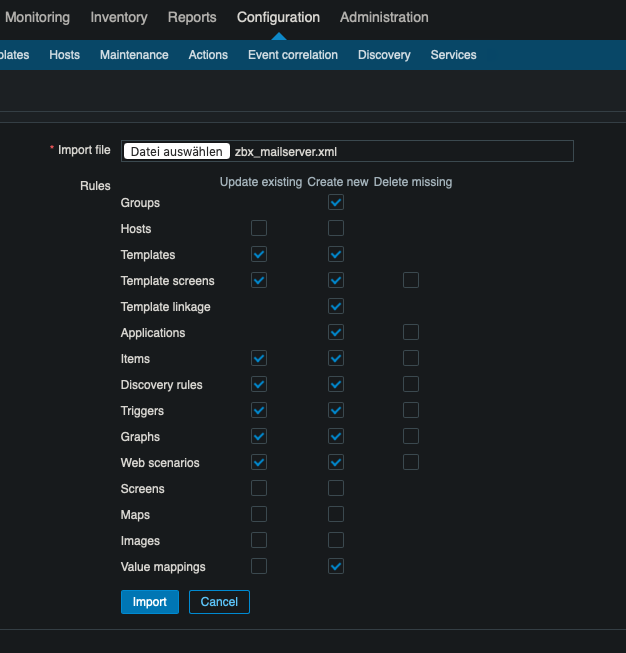
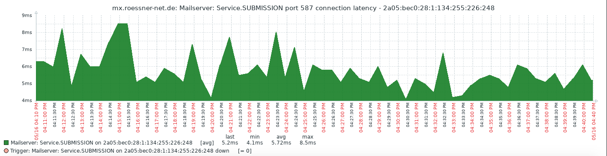

About
-----

This is a simple template for the Zabbix monitoring server. It was created
under version 4.2.1, but it may run with earlier versions as well.

The python script discovers a lot of common services on your mail server
and creates items and triggers for each and any service it found. Normally
the discover process runs every 12 hours, while the checks are down every
30 seconds.

Installation
------------

Copy the python script to /usr/local/bin. Make sure, you have at least
Python 3.x installed.

You can edit this file for your needs. The simplest way is to add all
your favorite services to the Enum called "Services". If you look at the
code, you will see that this is not a big deal, even if you are not a
developer.



In Zabbix add the template as usual. After that, you can directly add the
template to your host(s).

The template provides a macro

```
MAILSERVER_IP = 127.0.0.1
```

It scanns all services on the local IPv4 loopback interface. If you want
to scan more than one IP address, simply override the macro and set all
your hosts as a space seperated list. Also IPv6 is supported. Please no
not add brackets to these addresses.

This is an example from my server:

```
MAILSERVER_IP = 127.0.0.1 134.255.226.248 2a05:bec0:28:1:134:255:226:248```
```


Place the userparameter_mailserver.conf file in your zabbix-agent include
folder. Mostly it has a name like

```
/etc/zabbix/zabbix_agentd.d
```

Here is some example of a graph:



As I am running the service under Gentoo, I can not provide a working
SELinux policy yet. This may be added at a later time.